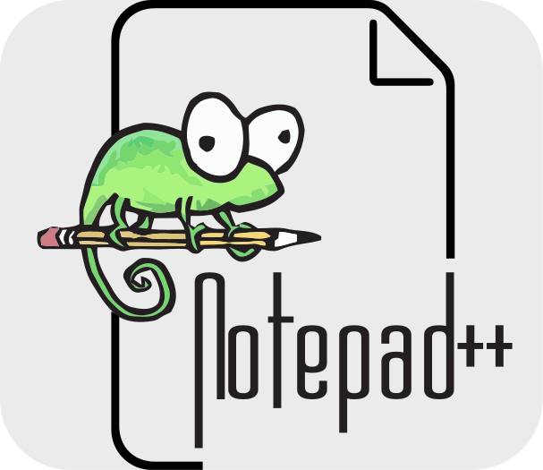

## Hi, I'm Fabian - aka InformaticFreak 👋

&nbsp;
&nbsp;
&nbsp;

* At last I published my Python3 library **[vectometry](https://github.com/InformaticFreak/vectometry)**
* Currently I am learning C for microcontroller programming
<!--
### Languages & Tools

&nbsp;
&nbsp;
&nbsp;
&nbsp;
&nbsp;
&nbsp;
&nbsp;
&nbsp;
-->
### Stats

<!-- &nbsp; -->
<!-- &nbsp; -->
