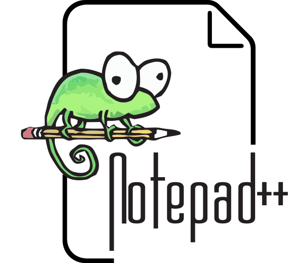

## Hi, I'm Fabian - aka InformaticFreak 👋

* 🔭 I'm currently working on my Python3 library **[vectometry](https://github.com/InformaticFreak/vectometry)**
* 🏳 I speak native **German** and some **English**
* 💬 Ask me about **Python3**

### Languages

&nbsp;
&nbsp;
&nbsp;

### Tools

&nbsp;
&nbsp;

### Stats

